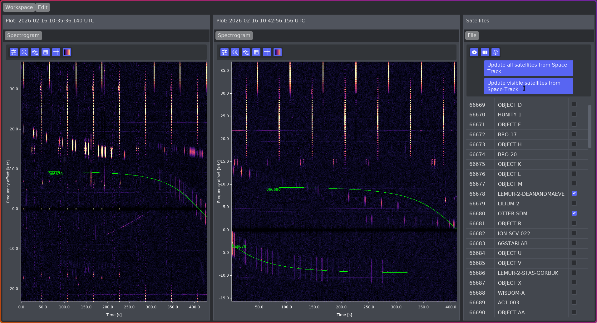
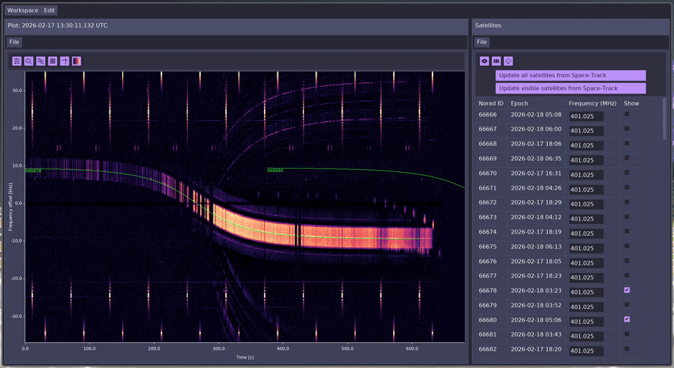

# rSTRF

rSTRF is a WIP rewrite of the excellent [strf satellite tracking toolkit for
radio observations](https://github.com/cbassa/strf).



Of the STRF tools, currently there is only an equivalent of the  `rfplot` tool.
I plan to add at least `rffit` and `rffft` as well.

---

rSTRF is designed to be a bit more user-friendly to use than STRF. It features

- mouse-based panning and zooming in the waterfall
- buttons and sliders instead of CLI flags
- workspaces of arbitrarily many panes (`rfplot`s) that you can save to disk
- a more modern tech stack (Rust + Iced) that should make building a bit easier
  (and theoretically even possible for Windows, although I haven't tested that)
- a config menu

It is still very much alpha software, but at least stable enough that I use it
regularly for my day job.

## Installation

### Ubuntu

```sh
sudo apt install build-essential libssl-dev pkg-config fontconfig \
  libfontconfig1-dev libopenblas-dev
```

### Nix

This repository includes a flake, so you can just

```sh
nix run github:jazzpi/rstrf
```

Alternatively, install these packages:

```
libxkbcommon
wayland
mesa
libGL
libglvnd
vulkan-loader
udev
openblas
dbus
pkg-config
openssl
fontconfig
```

### Build

You will also need to [install Rust](https://rust-lang.org/tools/install/),
then:

```sh
git clone https://github.com/jazzpi/rstrf -b v0.1.0
cd rstrf
cargo build --release
```

After the build is complete, you can run it with

```sh
cargo run --release
```

## Usage

The rSTRF workspace is composed of panes that you can split and rearrange:



There are currently two types of panes:

- *RFPlot* for viewing waterfalls/doppler shift traces
- *Satellite Manager* for managing your TLEs

The default workspace has one of each. In *RFPlot*, you can load spectrograms
generated with `rffft`. If it is split into multiple `.bin` files, you will need
to select all of them.

In the satellite manager, you can load TLEs from `.txt` or `.tle` files (2-line
and 3-line format should work). You then need to set frequencies for the
satellites, either through the text input or by loading the `frequencies.txt`
file from your STRF folder.

If you enter your [`space-track.org`](https://space-track.org) credentials in
the preferences menu, you can also fetch updates through the Space-Track API.
Make sure to [respect the API Use
Guidlines](https://www.space-track.org/documentation#/api).

## `rsmedfilt`

This repo also includes a CLI tool called `rsmedfilt` for preprocessing
spectrograms. It estimates the local noise floor using a median filter, then
subtracts it from the spectrogram. This can be helpful to bring out detail.

To run it, just run

```sh
# Nix
nix run github.com:jazzpi/rstrf#rsmedfilt --help
# Other systems
cargo run --bin rsmedfilt -- --help
```
