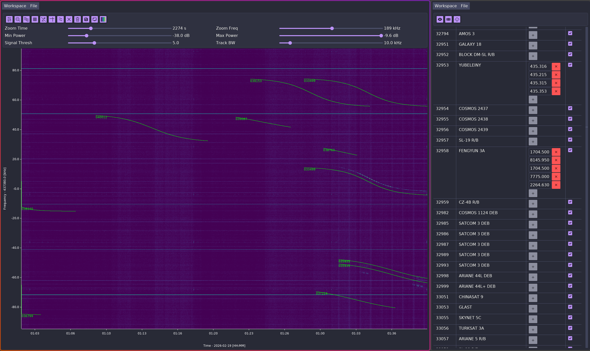

# rSTRF

rSTRF is a WIP rewrite of the excellent [strf satellite tracking toolkit for
radio observations](https://github.com/cbassa/strf).



Of the STRF tools, currently there is only an equivalent of the  `rfplot` tool.
I plan to add at least `rffit` and `rffft` as well.

---

rSTRF uses GPU-accelerated plotting instead of STRF's pgplot, which enables
fluid mouse-based panning and zooming in the waterfall. It also makes it easy to
have multiple plots active at the same time.

The different tech stack (Rust + Iced) makes building for Windows actually
possible and should make building for non-Debian systems a bit easier.

It is still very much alpha software, but at least stable enough that I use it
regularly for my day job.

## Installation

### Ubuntu

```sh
sudo apt install build-essential libssl-dev pkg-config fontconfig \
  libfontconfig1-dev libopenblas-dev
```

### Nix

This repository includes a flake, so you can just

```sh
nix run github:jazzpi/rstrf
```

Alternatively, install these packages:

```
libxkbcommon
wayland
mesa
libGL
libglvnd
vulkan-loader
udev
openblas
dbus
pkg-config
openssl
fontconfig
```

### Windows

Building on Windows is slightly more involved than on an average Linux system,
mainly due to [`vcpkg`](https://vcpkg.io). If you don't have it installed, you
can find instructions to do so
[here](https://learn.microsoft.com/en-us/vcpkg/get_started/overview).

After installing `vcpkg` (or if you already had it installed), it should be as
simple as running:
```sh
vcpkg install openblas --triplet x64-windows
```

> [!TIP]
> See [`openblas-src` repository README][openblas-src-readme] for more
> information.

### Build

You will also need to [install Rust](https://rust-lang.org/tools/install/),
then:

```sh
git clone https://github.com/jazzpi/rstrf -b v0.1.0
cd rstrf
cargo build --release
```

After the build is complete, you can run it with

```sh
cargo run --release
```

## Usage

### Spectrogram preparation

rSTRF does not (currently) include a way to record/generate spectrograms. For
this, please use STRF's `rffft`.

rSTRF does not use `rffft`'s data format directly. It first resamples the
spectrogram data to a constant rate. If you generate the `.bin` files from an IQ
recording, this does not change anything. However, if you record `.bin` files
live, the spectrogram is not recorded at a constant rate. So there it does make
a difference.

You can pre-convert the `.bin` files to rSTRF's format (`.rstrf`) with the
`rsbinfmt` tool. This will make loading it into rSTRF a bit faster.

For example, the following command will convert an hour's worth of `.bin` files
(recorded with the default `rffft` settings for `-t`/`-n`) into `.rstrf` format:

```sh
cargo run --release --bin rsbinfmt \
  /path/to/rffft_data/2026-02-19T00\:00\:01_*{00..59}.bin \
  /path/to/spec.rstrf
```

For more usage information, see `cargo run --release --bin rsbinfmt -- -h`.

### Plotting

Use the `plot` subcommand. You can pass `.rstrf` or `.bin` files (or a mix):

```sh
cargo run --release -- plot /path/to/spec.rstrf \
  -c /path/to/bulk.tle \
  -F /path/to/frequencies.txt \
  --zmin -38 \
  -C 4801
```

Unlike STRF's `rfplot`, you need to pass all the `.bin` files instead of just
the beginning of the file name (before the index):

```sh
cargo run --release -- plot \
  /path/to/rffft_data/2026-02-19T00\:00\:01_*{00..59}.bin
  -c /path/to/bulk.tle \
  -F /path/to/frequencies.txt \
  --zmin -38 \
  -C 4801
```

For more usage information, see `cargo run --release -- plot -h`.

Using the mouse, you can

- scroll to zoom (use `Ctrl`/`Shift`+scroll to zoom vertically/horizontally)
- click+drag to pan

There is a toolbar above the plot. Additionally, you can use the following
hotkeys:

- `r` -> Reset view
- `p` -> Toggle predictions
- `z` -> Zoom to rectangle
- `d` -> Delete trackpoints/signals in rectangle
- `ESC` -> Cancel rectangle action
- `s` -> Add trackpoint
- `f` -> Find signals around trackpoints ([see below](#signal-export))
- `D` -> Manually mark a signal ([see below](#signal-export))
- Arrow keys -> Pan (full plot width/height)
- `SHIFT` + arrow keys -> Pan (half plot width/height)

### Signal export

`f`/`D` work a little differently from STRF's `rfplot`. Pressing the keys by
themselves does not generate any `out.dat`/`mark.dat` files. Instead, once you
have found/marked all the signals (and potentially cleaned them up using `d`),
press the *Save* button in the toolbar. This will write all signals into an
`out.dat` file in the current directory.

Currently, the sigma field in the `out.dat` file is set to 5 for all signals.
The site ID field can be controlled using the `-C` CLI argument.

## Troubleshooting

You can enable debug logs and backtraces by setting the
`RUST_LOG`/`RUST_BACKTRACE` environment variables:

```sh
export RUST_LOG=debug
export RUST_BACKTRACE=1
```

## `rsmedfilt`

This repo also includes a CLI tool called `rsmedfilt` for preprocessing
spectrograms. It estimates the local noise floor using a median filter, then
subtracts it from the spectrogram. This can be helpful to bring out detail.

To run it, just run

```sh
# Nix
nix run github.com:jazzpi/rstrf#rsmedfilt --help
# Other systems
cargo run --bin rsmedfilt -- --help
```

[openblas-src-readme]: https://github.com/blas-lapack-rs/openblas-src/blob/openblas-src-v0.10.14/README.md#windows-and-vcpkg
